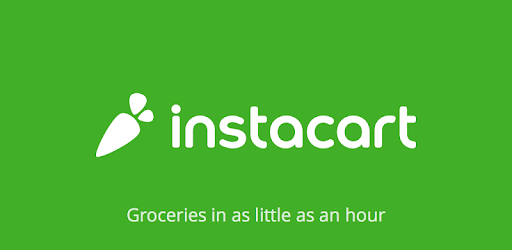

In this directory you will find four Jupyter Notebook with data from the [Instacart grocery delivery service](https://www.instacart.com).

These four notebooks were the main business case of the course "Special Topics in Information Systems Ι (ΟΔ710-1)" taught on Business Administration school of University of Macedonia, Thessaloniki, Greece. 

The course syllabus of the course can found on this link: [Special Topics in Information Systems I EN](https://docs.google.com/document/d/1AJzRZp244V-vNZStMMTDIwejdkNdlJZUv4u0J75zOsc/edit?usp=sharing).

The features that have been created in these kernels will be used on the sequential course "Special Topics in Information Systems ΙI (ΟΔ0806-1)" to create predictive models. The draft syllabus of the course can be found here: [Special Topics in Information Systems II EN](https://docs.google.com/document/d/1Wq4XQW1vdIm5qK327s6uLRJo0ZPrKng1gPOwNd1MbN8/edit?usp=sharing).

All the available Jyputer Notebooks are also hosted on my Kaggle account: [Symeon Kokovidis Kernels](http://kaggle.com/kokovidis/kernels)

The answers of the weekly assignments are available upon request.

---

_The data that have been used in these notebooks come from the “The Instacart Online Grocery Shopping Dataset 2017”, Accessed from [https://www.instacart.com/datasets/grocery-shopping-2017](https://www.instacart.com/datasets/grocery-shopping-2017)
on October-December 2018._

