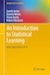

The scripts that can be found on each method, include hands-on guides for Machine Learning methods using Scotland's Official Statistical Data.

The scripts and tailor-made datasets that can be found on each method, apply in practice the covered topics.

Presentation slides and hands-on slides are available in the `sample_slides_supervised.pdf` .

Our main reference for this material were the book:

*James G, Witten D, Hastie T, Tibshirani R. (2017). An Introduction to Statistical Learning (8th ed.). New York: Springer.*

 	   

