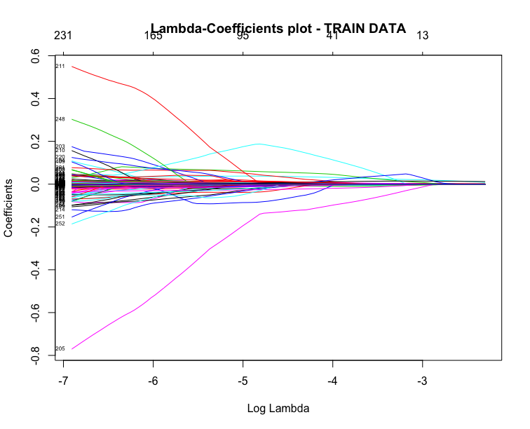

In this scenario we predict if an area belongs to an Urban Rural Classand more specifically on category 1 (Settlements of 125,000 or more people).  

[http://www.gov.scot/Topics/Statistics/About/Methodology/UrbanRuralClassification]()) 

The plots of coefficients and cross-validation, produced from the Lasso can be found below:

By choosing the appropiate lambda and on train data 75% & test data 25%:

The best model for which yields the lowest error, is a linear model with 32 variables . The estimation accuracy is 88,94%. And the confusion matrix is the following:

|Lowest accuracy|           |Reference|     |   |
|---------------|-----------|-----    |-----|---|
|               |           | **0**   |**1**|   |
|**Prediction** | **0**     |   900   |  89 |   |
|               |**1**      |    71   |  387|   |

