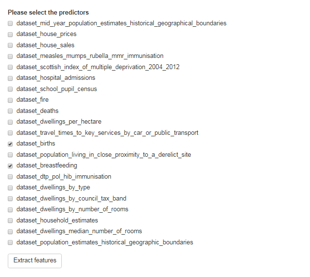

### Machine Learning Component for LSOD

The following module is a part of the H2020 OpenGovIntelligence project.

The Machine Learning Component enables the automatic extraction of numerous features from Linked Open Statistical Data (LSOD) based on the needs of the users and the predictive scenario that is implemented. It also enables the performance of dimension reduction based on the Lasso method in a user friendly approach. The implementation of the Machine Learning Component is based on the JSON-QB API and R server.

The future plans, is to embed supervised machine learning methods for classification and regression problems. The interface will give options for advanced users, who will able to determine the proportion of the train and test data for the fitting methods. In addition they will able to determine different preidction accuracy measures.

## Example on Statistics Portal of Scotland

The user will select the preferred response among a set of different predictors from various datasets. In addition the user will choose based on availability, the preferred time period (specific year, range of years, quartile of a year and more)

In the next step a request will be sent and the interface will return the available features for the selected time period.

Where the user will choose the desired features as predictors. Then the lasso will return the best number of predictors based on the "lowest MSE" rule and the "one standard error" rule. 
