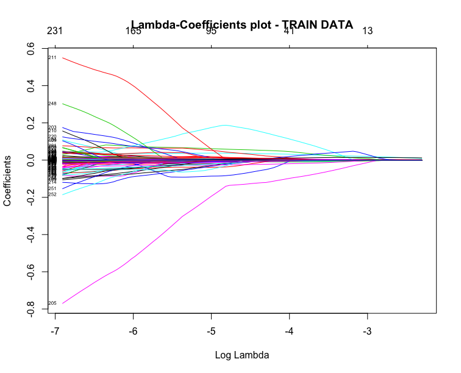

## The main scenario
In this scenario we predict if an area belongs to an Urban Rural Class and more specifically on category 1 (Settlements of 125,000 or more people).  

[http://www.gov.scot/Topics/Statistics/About/Methodology/UrbanRuralClassification]()) 

The plots of coefficients and cross-validation, produced from the Lasso can be found below:

**Note that the Lasso standarizes the features by default.**

By choosing the appropiate lambda and on train data 75% & test data 25%:

The best model for which yields the lowest error, is a  model with 32 variables . The estimation accuracy is 88,94%. And the confusion matrix is the following:

|Lowest accuracy|           |Reference|     |   |
|---------------|-----------|-----    |-----|---|
|               |           | **0**   |**1**|   |
|**Prediction** | **0**     |   900   |  89 |   |
|               |**1**      |    71   |  387|   |

 

## Examing the high accuracy 
As the resulting accuracy seemed to be very high we proceeded with several sanity tests.

For a split of 50% train - 50% test data the estimation accuracy reached 87,69% with 77 selected variables.
The execution time was 10.70239 mins

For a split of 25% train - 75% test data the estimation accuracy reached 86,76% with 77 selected variables.
The execution time was 5.130781 mins
 

For a split of 5% train - 95% test data the estimation accuracy reached 78,22% with 11 selected variables.
The execution time was 3.712784 secs and for different number of seeds, the results were nearly the same.

It seems that even with a small train dataset, it is possible to predict with more 75% accuracy if an area belongs to a settlment with more than 125000 residents.