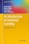

The following scripts, include all the steps from hands-on guides for Machine Learning methods using Scotland's Official Statistical Data.

The scripts accompany slides which they discuss the main rationate behind of every method.

Presentation slides and hands-on slides are available upon request.

Our main reference for these presentations and hands-on were the magnificent book:

An Introduction to Statistical Learning (ISLR)
with Applications in R 

 	   *Gareth James, Daniela Witten, Trevor Hastie and Robert Tibshirani*
	
